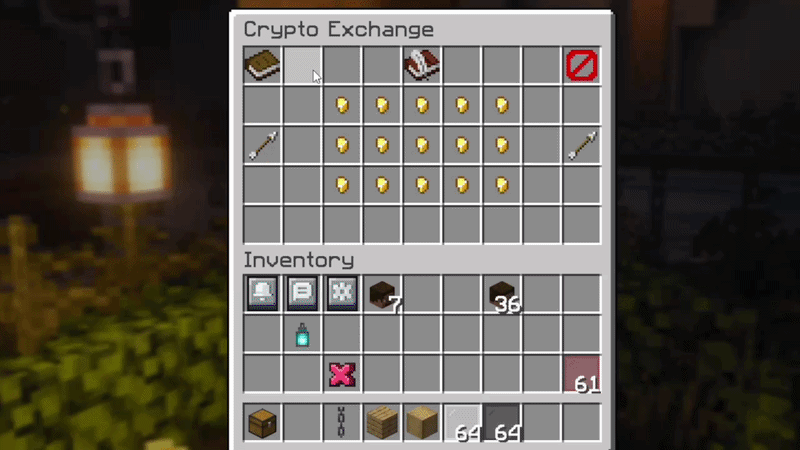

<p>
  
</p>


## About

**crypto-market-plugin** brings a real-time cryptocurrency exchange directly into Minecraft.
Players can buy and sell crypto assets using in-game currency, monitor live prices streamed
from the Binance WebSocket API, and track their portfolio value and ROI, all through
an interactive inventory-based GUI.

---

## Demo



---

## Architecture

The plugin is built on **Clean Architecture**. Each layer depends only on the layer below it, domain logic has zero external dependencies and no knowledge of Minecraft, databases, or any framework.


---

## Project Structure


---

## Features

- **Live prices** - Binance WebSocket stream with `ConcurrentHashMap` cache and automatic reconnect on failure
- **Buy & Sell** - full order lifecycle with partial position closing (FIFO) and configurable spread fee
- **Portfolio view** - open and closed positions with real-time P&L, filterable by state
- **MySQL / SQLite** - HikariCP connection pooling for MySQL, automatic fallback to embedded SQLite
- **In-memory cache** - `CachedWalletRepository` layer on top of ORMLite eliminates redundant DB reads
- **Admin panel** - in-game settings GUI, permission-gated, no server restart required
- **Vault integration** - works with any Vault-compatible economy plugin, transactional with rollback on failure
- **30+ coins** - BTC, ETH, SOL, DOGE, XRP and more - any Binance ticker can be added

---

## Configuration

```yaml
market:
  default-quote-currency: "USDT"   # USDT | EUR | PLN | TRY | GBP | BRL
  spread: 0.05                      # buy-side fee as decimal  (0.05 = 5%)

  tracked-cryptos:
    - "BTC"
    - "ETH"
    - "SOL"
    # any ticker supported by Binance

MySQL_database:
  enabled: false          # false → embedded SQLite (default)
  host: "localhost"
  port: 3306
  database: "crypto_exchange"
  user: "root"
  password: ""
  maximum_connections_hikariCP: 25
```

> [!WARNING]
> Removing a ticker from `tracked-cryptos` will prevent players from selling coins they already own. Adding new tickers is always safe.

---

---

## Installation

**Requirements:** Java 21 · Paper 1.20.6 · [Vault](https://www.spigotmc.org/resources/vault.34315/) · [PlaceholderAPI](https://www.spigotmc.org/resources/placeholderapi.6245/) · any Vault economy plugin (e.g. EssentialsX)

1. Download the latest `.jar` from [**Releases**](https://github.com/voxsledderman/crypto-market-plugin/releases)
2. Place it in your server's `plugins/` directory
3. Start the server - `config.yml` is generated on first run
4. Configure and reload

---

## Building from Source

```bash
git clone [https://github.com/voxsledderman/crypto-market-plugin.git](https://github.com/voxsledderman/crypto-market-plugin.git)
cd crypto-market-plugin

./gradlew shadowJar     # → build/libs/CryptoMarket-all.jar (or similar)
./gradlew test          # run unit tests

## Building from Source

```bash
git clone https://github.com/voxsledderman/crypto_exchange.git
cd crypto_exchange

./gradlew shadowJar     # → build/libs/CryptoExchange.jar
./gradlew test          # run unit tests
./gradlew runServer     # start local Paper 1.20.6 test server
```

---

## Commands & Permissions

| Command | Aliases | Description |
|---|---|---|
| `/exchange` | `/ex` `/crypto` `/giełda` | Open the exchange GUI |

| Permission | Default | Description |
|---|---|---|
| `cryptoexchange.admin.view` | `op` | View admin settings panel |
| `cryptoexchange.admin.change` | `op` | Edit settings via admin panel |

---

## Dependencies

<details>
<summary>View all dependencies</summary>

| Library | Version | Purpose |
|---|---|---|
| [Paper API](https://papermc.io) | 1.20.6 | Core server API (`compileOnly`) |
| [LiteCommands](https://github.com/Rollczi/LiteCommands) | 3.10.9 | Annotation-based command framework |
| [InvUI](https://github.com/NichtStudioCode/InvUI) | 1.49 | Inventory GUI with paged views |
| [AnvilGUI](https://github.com/WesJD/AnvilGUI) | 1.10.11 | Amount input via anvil screen |
| [ORMLite JDBC](https://ormlite.com) | 6.1 | ORM for SQLite & MySQL |
| [HikariCP](https://github.com/brettwooldridge/HikariCP) | 5.1.0 | MySQL connection pooling |
| [Java-WebSocket](https://github.com/TooTallNate/Java-WebSocket) | 1.5.3 | Binance WebSocket client |
| [Jackson Databind](https://github.com/FasterXML/jackson) | 2.15.2 | JSON parsing for ticker messages |
| [XChange Core](https://knowm.org/open-source/xchange/) | 5.1.0 | Currency display name resolution |
| [Vault API](https://github.com/MilkBowl/VaultAPI) | 1.7 | Economy abstraction (`compileOnly`) |
| [Lombok](https://projectlombok.org) | 1.18.36 | Compile-time boilerplate reduction |

</details>

---

## Tests

Unit tests cover core domain logic with no Minecraft runtime required.

```bash
./gradlew test
```

- `TradeOrderTest` - position lifecycle, open/closed P&L calculation
- `WalletCalculatorTest` - total acquired volume across open positions

---

## License

[MIT](LICENSE) — not affiliated with Binance or Mojang.
